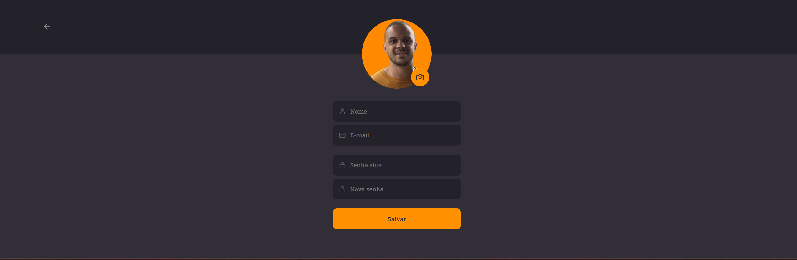
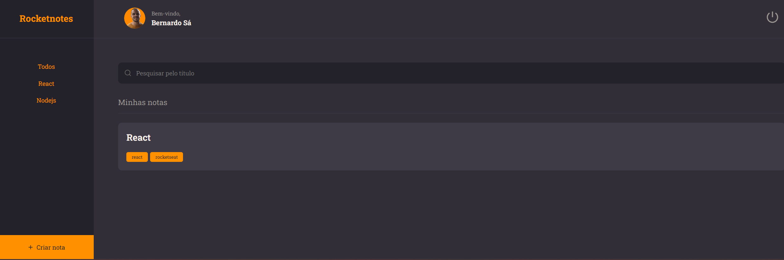

<h1 align="center"> Rocket Notes </h1>

<p align="center">
Programa promovido durante o nível 9 da trilha Explorer da Rocketseat para ensino de tecnologias WEB, com foco especial em ReactJS. 
</p>

- [Acesse o projeto finalizado, online](https://rocket-notes-brs3.vercel.app/)
<br><br>

<p align="center">
  
</p>

<br>

<p align="center">
  
</p>

<p align="center">
  
</p>

<p align="center">
  
</p>


## 🎯 Desafio
- Criar uma aplicação Front-end, utilizando as tecnologias citadas abaixo, onde o usuário efetua o login ou cadastro inicial, realiza o cadastro de notas, preenche informações como nome e descrição, e adiciona tags e links relacionados.

### Principais conceitos abordados
```ES6 Modules``` <br>
```CSS-in-JS```<br>
```Styled Components```<br>
```React Router```<br>
```React Fragment```


## 🚀 Tecnologias

Esse projeto foi desenvolvido com as seguintes tecnologias:

- HTML
- CSS-in-JS
- JavaScript
- ReactJS
- Vite
- Git
- Figma


## 🔖 Layout

Você pode visualizar o layout do projeto através [DESSE LINK](https://www.figma.com/file/e8sgpEVQhsUIzZeoeq8CUW/RocketNotes-Copy?fuid=1267229948111116557). É necessário ter conta no [Figma](https://figma.com) para acessá-lo.

## :memo: Licença

Esse projeto está sob a licença MIT.

---

Feito por Bernardo Sá :wave: [Participe da comunidade da Rocketseat!](https://discord.gg/rocketseat)